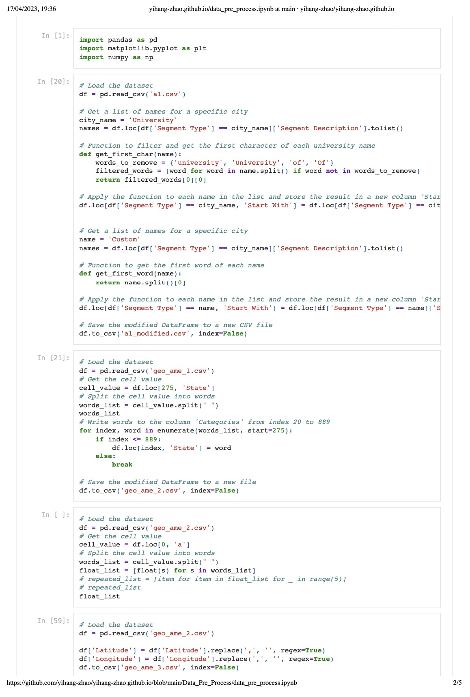
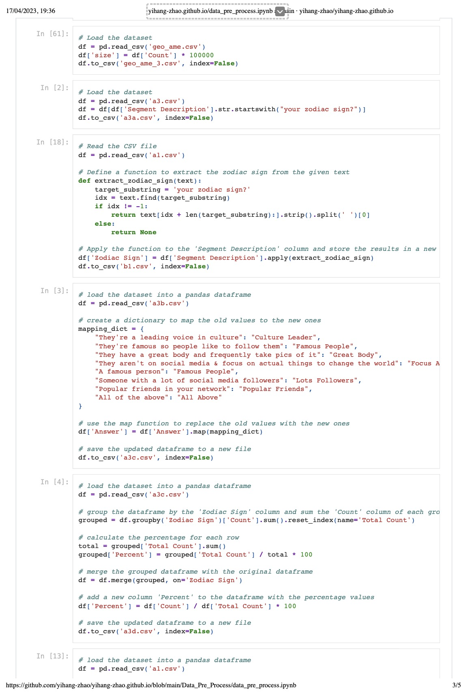
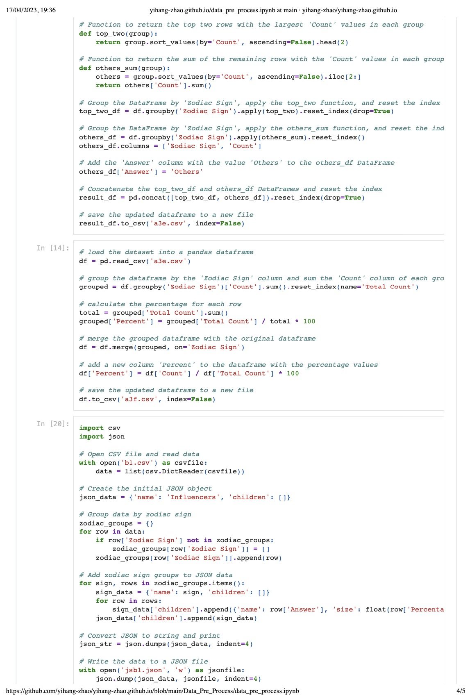

# Personalized Zodiac Insights Visualization
## Introduction
This project focuses on examining the relationship between Zodiac signs, perceptions of social media influencers, and the impact of social media on shopping behaviors. Complete design and insights could be seen from https://miro.com/app/board/uXjVMVP_Drw=/?share_link_id=14153724503
## Datasets
The analysis is based on two datasets provided by Adam Halper, which can be found at the following links:
1. Social Influence on Shopping: https://data.world/ahalps/social-influence-on-shopping
2. Online Influencer Marketing: https://data.world/ahalps/online-influencer-marketing

## Goal
The primary goal of this research is to explore if there are any similarities or differences between Zodiac signs in terms of their preferences and perceptions of social media influencers and how these preferences influence their shopping behaviors.

## Data Processing and Acknowledgements
In this project, I aimed to create an interactive visualization of Zodiac sign insights based on demographic data from various sources. The data processing pipeline involved several crucial steps to ensure the final visualization accurately represents the desired information and relationships.

1. Data extraction and cleaning: The raw dataset contained a diverse range of demographic attributes for participants. I focused specifically on the Zodiac sign groups, extracting relevant rows and simplifying the segment name column by retaining only the Zodiac sign names.
2. Data consolidation and categorization: I analyzed and filtered rows from a second dataset containing questions pertaining to the most important traits of influencers. I identified eight distinct answer types and combined similar answers (e.g., 'a famous person' and 'They are famous so people like to follow') into a single category, such as 'Famous person'. I then recalculated the percentages for each answer within each Zodiac sign group to ensure accurate representation.
3. Data transformation and hierarchical structuring: To create a sunburst graph for the visualization, I merged the processed datasets and converted them into a hierarchical JSON format. The structure comprised multiple depth levels: depth 0 representing Zodiac signs, depth 1 denoting the four Zodiac elements (Earth, Air, Fire, and Water), depth 2 specifying each Zodiac sign within an element, depth 3 differentiating between social media preferences and influencer preferences, and depth 4 detailing the answer categories for the selected aspect (7 types for influencers and 5 types for social media).
By meticulously processing and transforming the data, I created a robust foundation for my Zodiac Insights Visualization, enabling users to explore and compare various aspects of Zodiac signs with ease and accuracy.

  
  
  

The data used in this project has been collected from various reliable sources and processed to create an insightful and interactive visualization. I'd like to express my gratitude to the following data sources:

1. Social Influence on Shopping: https://data.world/ahalps/social-influence-on-shopping
2. Online Influencer Marketing: https://data.world/ahalps/online-influencer-marketing

## Visualization

The project features an interactive sunburst chart that presents the data in a hierarchical structure, making it easy to explore and analyze the relationships between the variables. The chart allows users to navigate through different layers of data, providing insights into the preferences and behaviors of each Zodiac sign and their respective groups.

## Features

Interactive sunburst chart for easy exploration of the data
Personalized visualization toolbar allowing users to filter and customize the chart
Colorblindness-friendly color options
Dynamic text size and style adjustments for improved accessibility
Detailed tooltips displaying specific information for each data point
Preprocessing and Data Transformation
The datasets have undergone preprocessing and transformation to create a suitable hierarchical structure for the sunburst chart. This includes filtering relevant rows, combining similar answers, and recalculating percentages for each group. The final JSON file consists of a depth-based structure that represents Zodiac signs, Zodiac groups, preferences, and answer types.

## Acknowledgements

I would like to express my gratitude to Adam Halper for providing the two datasets that have been instrumental in this research. These datasets have contributed significantly to the analysis and understanding of the relationship between Zodiac signs, social media influencers, and shopping behaviors.
